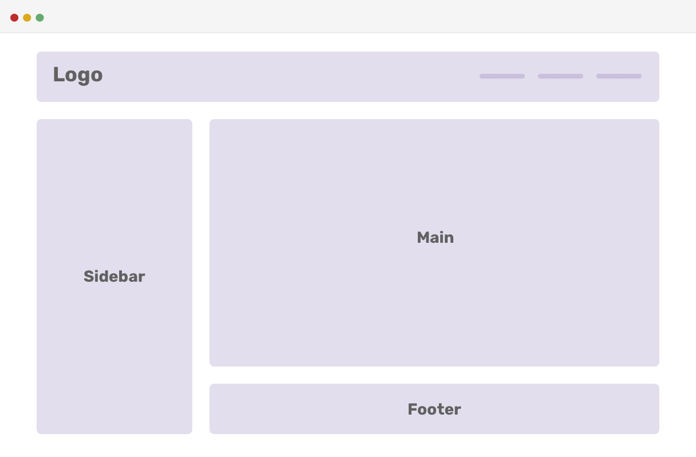
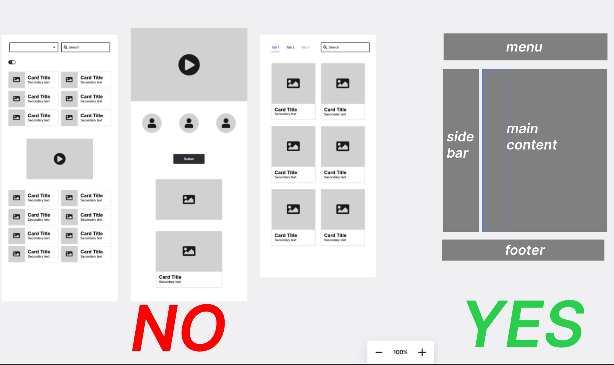

# web2025-layout-library

Common layout patterns for you to use in your websites. This is to provide helpers for common, bare skeletons within which you can start adding your own designs and giving you some "starting" spaces. These are by no means fully-fleshed out websites or full designs, but only structural elements (divs, section) that you can use and insert things in.

## Browse Available Layouts

Check out the **[library/](library/)** folder to see all available layout patterns with previews and examples. 

## Requesting a layout

For requesting a new layout pattern, break your layout into the bare minimum "plots". Images that are expected are like this:

Do's: 
- Submit an image with 3-4 elements like in the image example above. 
- Label your plots of area such as "menu", "sidebar", "main content". 
- Post only up to 1-2 images, one image for each page. 
- Go through the '[Issues](https://github.com/open-making/web2025-layout-library/issues)' page to see if someone has already requested a layout **similar to yours**. If that is the case, **then only reacting to that issue comment is enough**, think of it like a `+1` on Whatsapp. 
- Try to think about what your layout looks like at the lowest, most minimum level.
- Try to adapt an existing layout to your design.

Don't's: 
- **Do not submit high-fidelity designs**. 
- Do not expect a completely done layout.
- Do not be disappointed when asked to adapt an existing layout.

## How to Submit

Head over to [issues](https://github.com/open-making/web2025-layout-library/issues/1) to add a new request.

**In the issue comment, describe your layout and attach a minimal, labelled image of your layout.**

