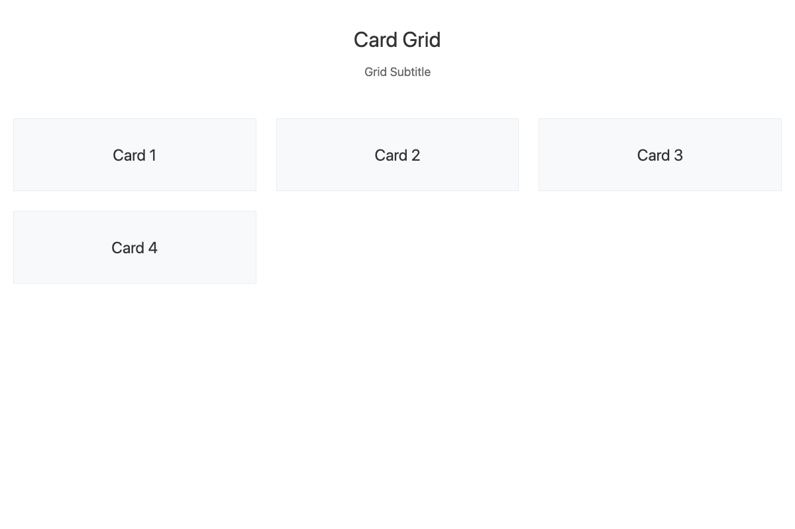
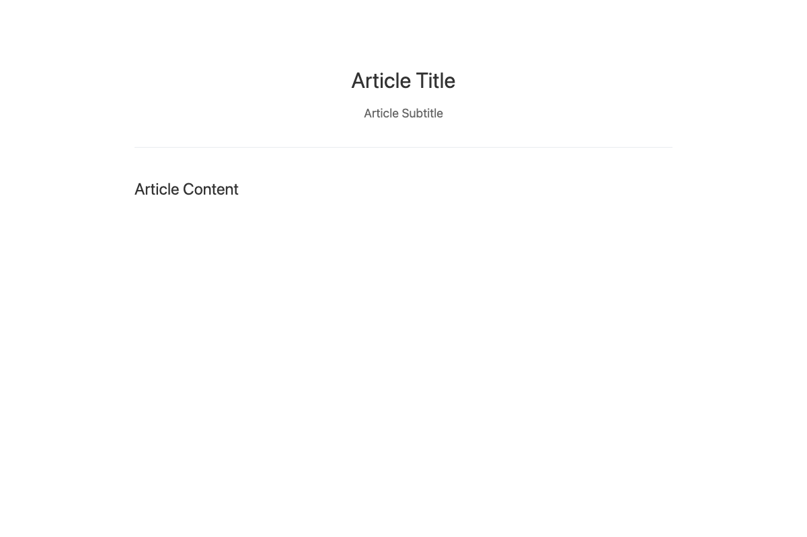
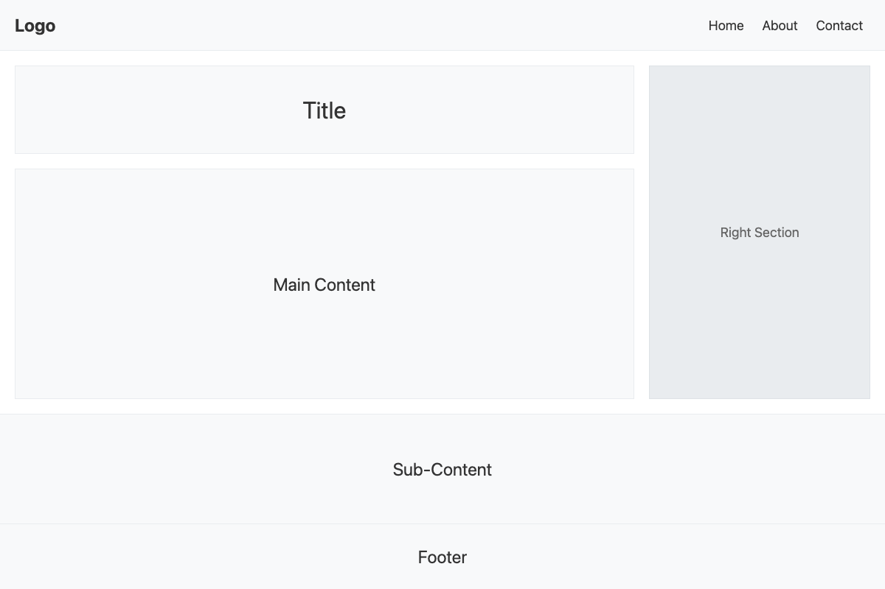
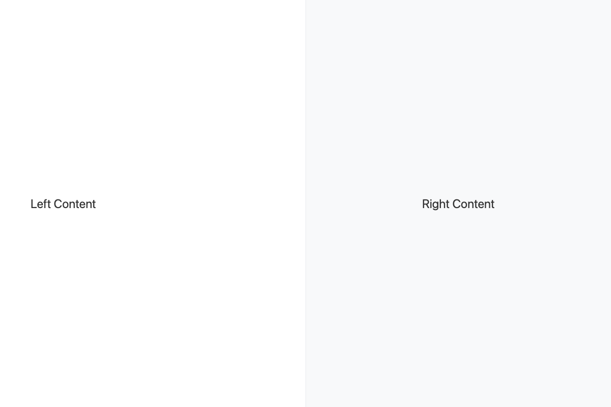

# Layout Library

A collection of layout patterns and components.

## Available Layouts

| Layout | Preview |
|--------|---------|
| [CardGrid](CardGrid/) |  |
| [CenteredArticle](CenteredArticle/) |  |
| [FixedSidebar](FixedSidebar/) |  |
| [HolyGrail](HolyGrail/) |  |
| [SplitScreen](SplitScreen/) |  |

## Usage

Each layout directory contains:
- `index.html` - Standalone demo
- `*.astro` - Astro component implementation
- `example.astro` - Usage example
- `screenshot.png` - Visual preview
